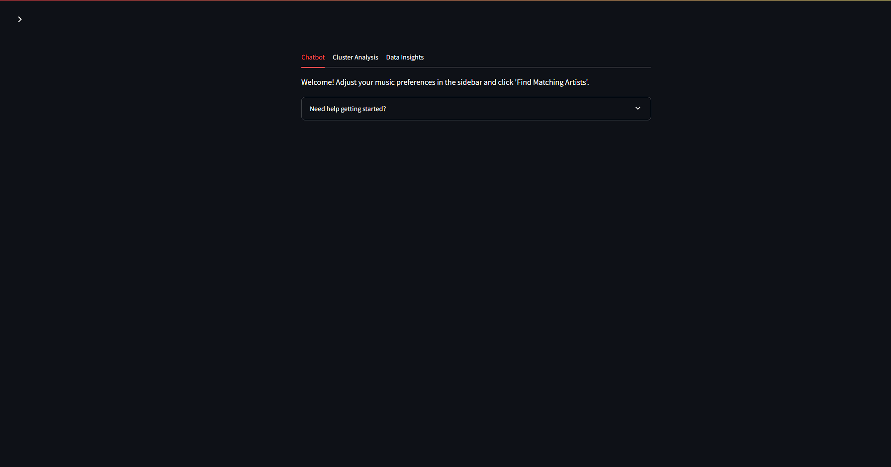
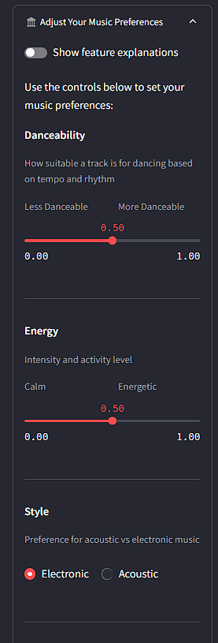
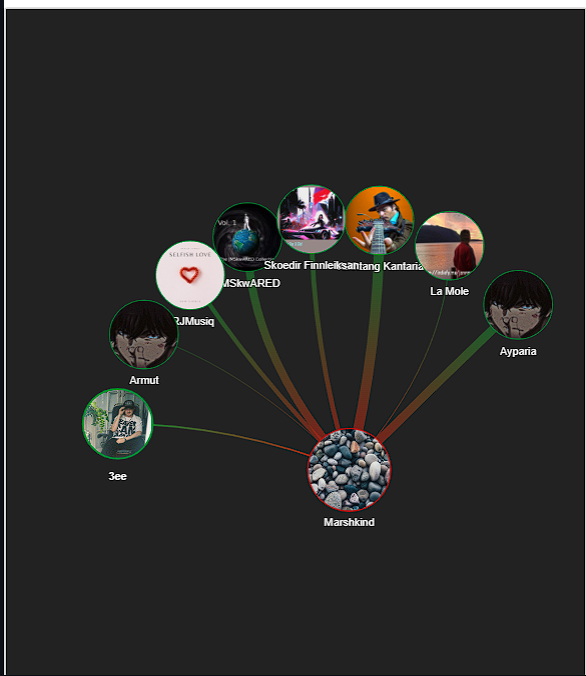
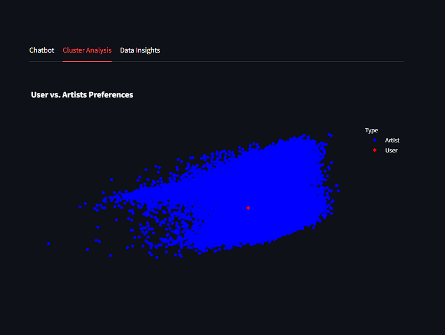
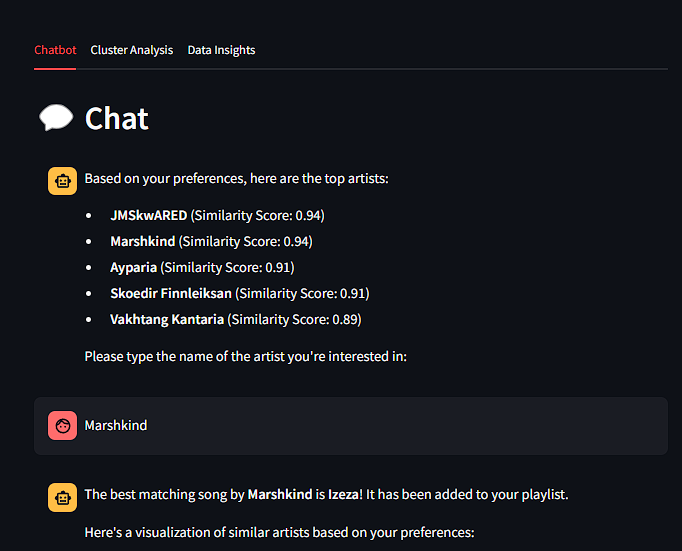

# Personalized Spotify Playlist Generator 🎵

This is a Streamlit-based application that recommends personalized playlists based on user preferences and visualizes artist similarity. Using PyVis and Plotly for interactive visualizations and a custom recommendation model, the app provides tailored music suggestions and displays similar artists in an intuitive interface.


*Main interface showing the chatbot, visualization tabs, and preference controls*

## Features

### 🎯 Personalized Recommendations
- Adjust music feature preferences using intuitive sliders and controls
- Get tailored artist and song recommendations based on:
  - Danceability
  - Energy
  - Style (Acoustic/Electronic)
  - Vocals (Instrumental/With Vocals)
  - Recording Type (Studio/Live)
  - Mood
  - Loudness
  - Popularity


*Preference adjustment interface with sliders and binary choices*

### 🕸️ Artist Similarity Visualization
- Interactive network graph showing relationships between artists
- Color-coded nodes indicating similarity scores
- Hover information displaying detailed artist features
- Adjustable layout and zoom capabilities


*Artist similarity network showing connections and relationships*

### 📊 Cluster Analysis
- PCA visualization plotting your preferences against artist profiles
- Interactive scatter plot with hover information
- Clear clustering of similar artists
- Your preference point highlighted for easy reference


*PCA visualization showing artist clusters and user preferences*

### 💬 Interactive Chat Interface
- Natural language interaction for music discovery
- Request recommendations based on specific criteria
- View detailed song information and artist details
- Easy playlist management through chat commands


*Chatbot interface showing recommendation interaction*

## Prerequisites
- **Python 3.11 or higher**
- **Poetry** for package management
- **Spotify Dataset** in a SQLite database (`music_data.db`) that includes:
  - Artist profiles with musical features
  - Songs with audio features for recommendation

## Installation

1. **Clone the Repository**:
   ```bash
   git clone https://github.com/keithdeu4/CSE6242_Team148.git
   cd CSE6242_Team148 
   ```

2. **Set Up the Virtual Environment Using Poetry**:
   ```bash
   # Install Poetry if needed
   curl -sSL https://install.python-poetry.org | python3 -
   
   # Install dependencies
   poetry install
   ```

3. **Activate the Virtual Environment**:
   ```bash
   poetry shell
   ```

4. **Data Preparation**
To retrieve and prepare data for this project:

1. **Retrieve Random Spotify Tracks**:
   - Use the `notebooks/retrieve_random_spotify_tracks.ipynb` to download random tracks.

2. **Generate Synthetic Data** *(Optional)*:
   - Use the `notebooks/prepare_data.ipynb` to clean Spotify tracks and create necessary database.

The datasets will be saved in the `src/assets/` folder automatically.

5. **Run the Streamlit App**:
   ```bash
   streamlit run src/app.py
   ```

## Usage

### Setting Preferences
1. Open the preferences panel in the sidebar
2. Adjust sliders for continuous features
3. Select options for binary choices
4. Click "Find Matching Artists" to update recommendations

### Managing Playlists
- Search/filter your playlist
- Remove individual songs
- Clear entire playlist
- Save playlist as CSV
- Click song titles to open in Spotify

### Exploring Visualizations
- Switch between tabs for different views
- Interact with graphs using mouse
- Hover over elements for detailed information
- Use controls to adjust visualization parameters

## Project Structure
```plaintext
spotify-graph-playlist/
├── src/
│   ├── app.py                 # Main Streamlit app
│   ├── chatbot.py             # Chatbot functionality
│   ├── database.py            # Database connection and queries
│   ├── genre_profiles.py      # Functions for processing genres
│   ├── graphs.py              # Functions for visualizing graphs
│   ├── models.py              # Recommendation and ML models
│   ├── queries.py             # SQL queries and database operations
│   ├── state_management.py    # Session state initialization
│   ├── synthetic_data.py      # Synthetic data generation helpers
│   ├── visualizations.py      # Visualizations for recommendations
├── notebooks/
│   ├── prepare_data.ipynb     # Notebook for preparing Spotify tracks
│   ├── synthetic_data.ipynb   # Notebook for creating synthetic data
│   ├── retrieve_random_spotify_tracks.ipynb   # Notebook for downloading random tracks from spotify
├── src/assets/                # Data files and saved graph data
│   ├── albums.csv
│   ├── artists.csv
│   ├── track_artists.csv
│   ├── track_features.csv
│   ├── track_genres.csv
│   ├── tracks.csv
├── images/                    # Screenshot and diagram assets
```


## Dependencies
Main packages (managed through Poetry):
- `streamlit>=1.24.0`
- `pandas>=2.0.0`
- `plotly>=5.13.0`
- `pyvis>=0.3.1`
- `scikit-learn>=1.2.2`

## Contributing
1. Fork the repository
2. Create a new branch for your feature
3. Submit a pull request with a clear description
